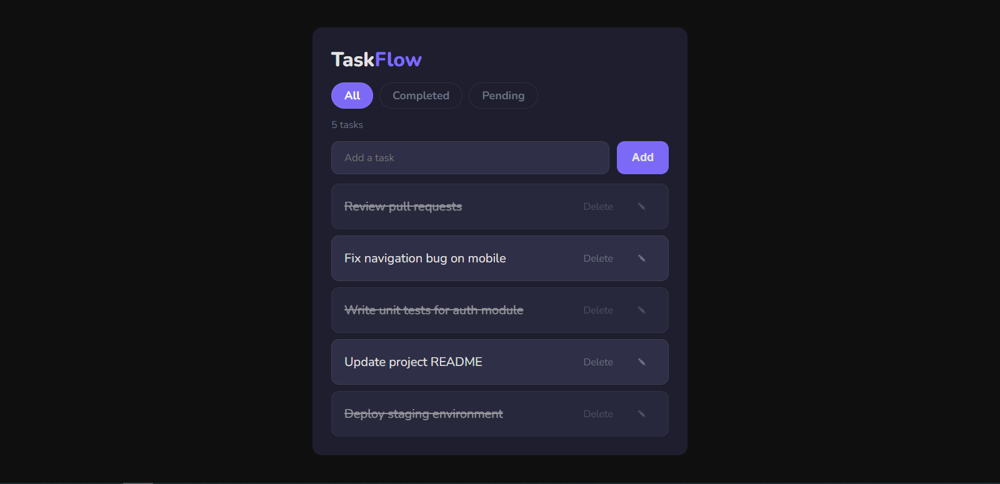

# TaskFlow

TaskFlow is a simple and well-structured task manager built with vanilla JavaScript.
The focus of this project is on DOM manipulation, state management, and clean, maintainable code — without relying on frameworks.

---

## Live Demo

👉 [View Live Demo](https://juan-xavier375.github.io/TaskFlow/) (placeholder - update with actual URL)

---

## Features

- Create, edit, and delete tasks
- Mark tasks as completed with a single click
- Filter tasks (All, Pending, Completed)
- Live task counter (pending tasks)
- Inline editing with save on blur or Enter
- Keyboard support for fast interactions
- Persistent data using localStorage
- Contextual empty states

---

## Tech Stack

- HTML5 (semantic structure)
- CSS3 (custom properties, flexbox)
- JavaScript (Vanilla)

No frameworks, no libraries, no build tools.

---

## How it works

The application follows a simple and predictable data flow:

User action → Update state → Save to localStorage → Re-render UI

All tasks are stored in a single array:

- id: number
- text: string
- done: boolean

The UI is always derived from this state, which keeps behavior consistent and easier to debug.

---

## Code Organization

The code is structured by responsibility:

- **State** → `tasks`, `currentFilter`
- **Rendering** → `renderTasks`, `addTaskToList`, `renderCounter`, `emptyList`
- **Storage** → `saveTasks`, `loadTasks`
- **Actions** → `getTaskById`, `deleteTaskById`, `toggleTaskById`, `saveEdit`
- **Events** → delegated event listeners and input handling

---

## Getting Started

Clone the repository:

git clone https://github.com/Juan-Xavier375/TaskFlow.git
cd TaskFlow

Open `index.html` in your browser.

No setup needed.

---

## Project Structure

TaskFlow/
├── index.html
├── styles.css
├── main.js
└── assets/
    └── preview.png

---

## Future Improvements

- Drag and drop task reordering
- Task prioritization or due dates
- Light/Dark theme toggle
- Basic test coverage

---

## Author

Developed by Juan Xavier
https://github.com/Juan-Xavier375
